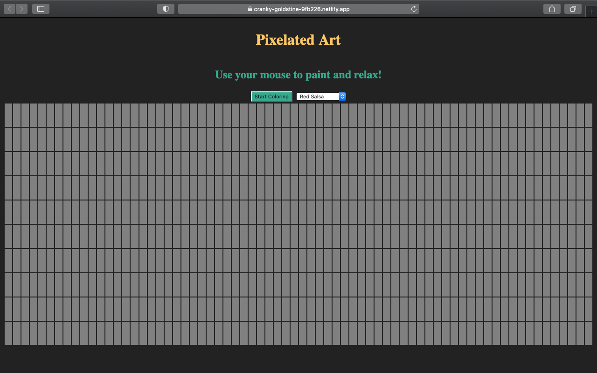

# 🎨 E-Colorize 🎨

- [Link to the Deployed App](https://cranky-goldstine-9fb226.netlify.app/)
  <br/>
  E-Colorize is a Progressive Web App (PWA) built to provide a creative playground for users to paint, relax and unwind.
  

---

## 🎨 Prompt

Build a small editor for making 8-bit art! You should be able to re-create characters from all your favorite classic video games!

---

## 📺 Project Presentation:

[ Watch the Video presentation](https://youtu.be/D1PXq5mb8NY)

---

## 🎨 How to Use this Repository?

```shell
git clone https://github.com/mcherry000/pixelated.git
npm install
npm start
```

---

## 💻 Tech Stack:

[][html]

[][css]

[][js]

[][netlify]

[][github]

[][canva]

[][npm]

[][node]

[html]: http://www.w3.org/html/logo/
[css]: http://www.w3.org/html/logo/
[canva]: https://www.canva.com/
[npm]: https://github.com/npm/logos
[node]: https://nodejs.org/en/about/resources/
[netlify]: https://www.netlify.com/press/
[js]: https://github.com/voodootikigod/logo.js
[html]: http://www.w3.org/html/logo/
[github]: https://github.com/logos

## <br/>

## 🧚‍♀️ How to get started?

- [To get Started, click here!](https://cranky-goldstine-9fb226.netlify.app/)
  <br/>
  On clicking, your screen will look like this
  

---

##🧑‍🎨 How to set up a new canvas for drawing?

Click Start Coloring.


---

## 🧑‍🎨How to select colors for painting?

Select colors from the drop down menu.


---

## 🧑‍🎨How to paint or draw?

Hover your mouse over the pixelated canvas and click to fill in your color.


---

## 👩‍ Created by


| Engineer | LinkedIn Profile | GitHub Profile |
| ----------------- | ------------------------------------------------ | ------------------------------- |
| ☀️ Manika Arora | https://www.linkedin.com/in/manika-a-11692716b/| https://github.com/mcherry000 |

---
